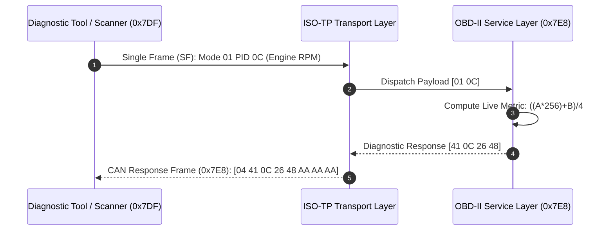

# 🚗 Automotive ISO-TP & OBD-II Diagnostics Core

[](https://en.wikipedia.org/wiki/C99)
[](https://www.iso.org/)
[](https://en.wikipedia.org/wiki/CAN_bus)
[](LICENSE)

A high-performance, MISRA-C compliant **Automotive Diagnostics Protocol Stack** implementing **ISO 15765-2 (ISO-TP)** multi-frame network transport and **SAE J1979 / OBD-II** diagnostic service handling for microcontrollers (STM32, ESP32, NXP S32K) and CAN transceivers.

---

## 🔌 Hardware Circuit Diagram & Automotive OBD-II Interface

```
 +---------------------------------------------------------------------------------------------------+
 |                                   AUTOMOTIVE CAN BUS WIRING HARNESS                                |
 +---------------------------------------------------------------------------------------------------+

     [ Microcontroller (STM32/ESP32) ]
              |          |
         (SPI SCK)   (SPI MOSI)
              |          |
              v          v
     +-------------------------------+               +-------------------------------+
     |      MCP2515 CAN Controller   |               |     TJA1050 / MCP2551         |
     |   (Stand-Alone SPI Controller)|               |     High-Speed Transceiver    |
     |                               |               |                               |
     |                           TXD |-------------->| TXD                           |
     |                           RXD |<--------------| RXD            [ 120Ω Term ]  |
     |                           INT |               |                 Resistor      |
     |                           CS  |               |                     |         |
     +-------------------------------+               |           CANH -----+--------( Pin 6: CAN High )
                                                     |           CANL -----+--------( Pin 14: CAN Low )
                                                     +-------------------------------+
                                                                                            |
                                                                             +--------------v--------------+
                                                                             |   SAE J1962 OBD-II PORT     |
                                                                             |                             |
                                                                             |  Pin 4: Chassis GND         |
                                                                             |  Pin 5: Signal GND          |
                                                                             |  Pin 6: CAN-H (500 kbps)    |
                                                                             |  Pin 14: CAN-L (500 kbps)   |
                                                                             |  Pin 16: +12V Battery Power |
                                                                             +-----------------------------+
```

---

## 🏛️ System Architecture & Frame Flow



---

## ⚡ Supported Diagnostic Modes & PIDs

| Service Mode | PID | Name | Standard Formula | Unit |
| :--- | :--- | :--- | :--- | :--- |
| **Mode 01** | `0x0C` | Engine RPM | `((A * 256) + B) / 4` | RPM |
| **Mode 01** | `0x0D` | Vehicle Speed | `A` | km/h |
| **Mode 01** | `0x05` | Engine Coolant Temp | `A - 40` | °C |
| **Mode 01** | `0x11` | Throttle Position | `(A * 100) / 255` | % |
| **Mode 01** | `0x04` | Calculated Engine Load | `(A * 100) / 255` | % |
| **Mode 03** | - | Stored Trouble Codes | Read active DTCs (`P0301`, `P0420`) | 2-byte DTC |
| **Mode 04** | - | Clear Diagnostic Codes | Reset DTCs & MIL Check Engine Lamp | Acknowledged |

---

## 🛠️ Build & Verification

```bash
# Build diagnostic stack
gcc -Wall -Wextra -Iinclude src/iso_tp.c src/obd2.c src/mcp2515_can.c src/main.c -o obd_diag_core

# Execute the diagnostic stack simulation
./obd_diag_core

# Run the Python virtual test harness
python tools/virtual_ecu_fuzzer.py
```

---

## 👤 Author
* **Herambeswar Mandadapu** – [@mandadapuherambeswar-ux](https://github.com/mandadapuherambeswar-ux)
* **LinkedIn:** [Herambeswar Mandadapu](https://linkedin.com/in/herambeswar-mandadapu-5a977a385)
