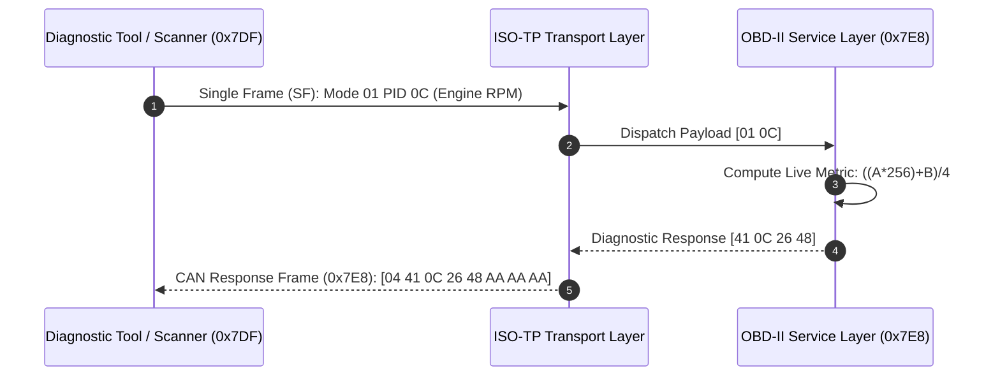

# 🚗 Automotive ISO-TP & OBD-II Diagnostics Core

[](https://en.wikipedia.org/wiki/C99)
[](https://www.iso.org/)
[](https://en.wikipedia.org/wiki/CAN_bus)
[](LICENSE)

A high-performance, MISRA-C compliant **Automotive Diagnostics Protocol Stack** implementing **ISO 15765-2 (ISO-TP)** multi-frame network transport and **SAE J1979 / OBD-II** diagnostic service handling for microcontrollers (STM32, ESP32, NXP S32K) and CAN transceivers.

---

## 🏛️ System Architecture



---

## ⚡ Core Features

1. **Full ISO 15765-2 Transport Protocol**:
   - Handles **Single Frames (SF)**, **First Frames (FF)**, **Consecutive Frames (CF)**, and **Flow Control (FC)** with configurable Block Size (`BS`) and Separation Time (`STmin`).
   - Supports segmented payloads up to **4,095 bytes** with deterministic buffer bounds and timeout guards.
2. **SAE J1979 Diagnostic Service Handlers**:
   - **Mode 01**: Live sensor telemetry readouts (Engine RPM, Speed, Coolant Temp, Throttle Position, Engine Load, MAF).
   - **Mode 03**: Reading confirmed Diagnostic Trouble Codes (DTCs) e.g., `P0301`, `P0420`.
   - **Mode 04**: Clearing DTCs and resetting MIL status.
   - **Mode 09**: Vehicle identification metadata.
3. **Hardware Agnostic & Mocking Suite**:
   - Zero hardcoded hardware dependencies. Runs seamlessly over hardware CAN controllers (MCP2515, STM32 bxCAN, SocketCAN) or virtual software buses.
   - Python-based test harness (`tools/virtual_ecu_fuzzer.py`) for automated fuzzing and regression testing.

---

## 🛠️ Build & Verification

```bash
# Build with GCC / Clang
gcc -Wall -Wextra -Iinclude src/iso_tp.c src/obd2.c src/main.c -o obd_diag_core

# Execute the diagnostic stack simulation
./obd_diag_core

# Run the Python virtual test harness
python tools/virtual_ecu_fuzzer.py
```

---

## 👤 Author
* **Herambeswar Mandadapu** – [@mandadapuherambeswar-ux](https://github.com/mandadapuherambeswar-ux)
* **LinkedIn:** [Herambeswar Mandadapu](https://linkedin.com/in/herambeswar-mandadapu-5a977a385)
